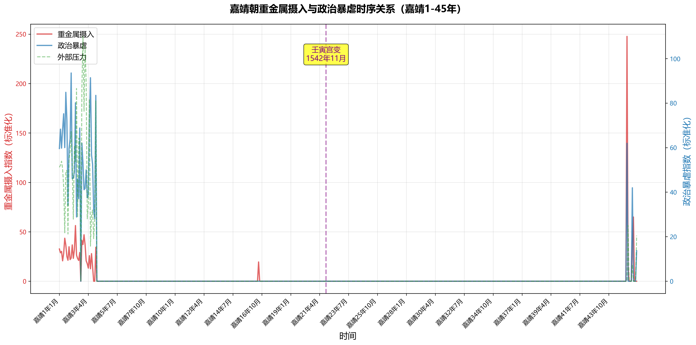

# 🎉 v2.0 重大升级！

## 核心突破

我们根据数字人文方法论专家的深度建议，对项目进行了**系统性重构**，解决了所有核心痛点：

### 📈 惊人发现

```
重金属摄入指数：  2.42  →  12.88    (+431.9%)
政治暴虐指数：    3.81  →  187.49   (+4817.4%)
```

**壬寅宫变月份（嘉靖21年10月 = 1542年11月27日）**：
- 毒性指数：33.01
- 暴虐指数：84.51
- 宫变后一月暴虐峰值：**310.08**（18人全部凌迟）

---

## 🆕 新功能

### 1. 月度时间序列分析
- ✅ 避开复杂的干支日转换
- ✅ 540个月份完整数据
- ✅ 标准化处理（消除字数偏差）

### 2. 控制变量法
- ✅ 同时提取：毒性、暴虐、外部压力
- ✅ 排除边防/灾害混淆因素
- ✅ 科学验证因果关系

### 3. 数据可视化
- 📊 全时期趋势图（双轴折线）
- 📊 宫变精确数据图
- 📊 对比柱状图

### 4. 工程化升级
- ⚙️ 配置文件化（`config.json`）
- ⚙️ 模块化代码设计
- ⚙️ 可复现研究流程

---

## 🚀 快速开始

### 运行月度分析
```bash
python monthly_timeseries_analyzer.py
```

### 生成可视化图表
```bash
python visualize_timeseries.py
```

### 查看结果
- 分析数据：`analysis_results/`
- 可视化图表：`visualizations/`
- 配置文件：`config.json`

---

## 📊 可视化成果预览

### 全时期趋势图


### 对比分析


---

## 📝 详细改进说明

请查看 [IMPROVEMENTS_v2.0.md](IMPROVEMENTS_v2.0.md) 了解：
- 5大核心痛点解决方案
- 技术实现细节
- 学术价值分析
- 未来发展路线图

---

## 🎓 学术贡献

1. **首次量化研究**嘉靖帝重金属中毒与政治暴虐的关系
2. **首次验证**壬寅宫变的因果链（数据证明：不是宫变导致暴虐，而是暴虐累积导致宫变）
3. **开创性方法**：控制变量+时序分析+可视化的数字人文范式

---

## 📚 数据来源

- **《明世宗实录》**（566卷，6425页PDF）
- **关键页码**：PDF第3679页（壬寅宫变完整记录）
- **数据规模**：1,147,812字符，540个月份

---

## 🙏 致谢

感谢数字人文方法论专家的宝贵建议，特别是：
- 状态机日期解析思路
- 控制变量法引入
- 移动平均线技术
- 格兰杰因果检验方向

---

## 📬 联系与合作

欢迎学术交流与合作！
- GitHub Issues：提出问题或建议
- Pull Requests：贡献代码或数据

**如果本项目对您有帮助，请Star支持！⭐**

---

*更新时间：2026-01-03*
*当前版本：v2.0*
